###############################################################################
# Task 1: Preliminary data analysis
###############################################################################

## Defining color palette

``` r
colors <- list(
  primary = "#2E4A6B",      # Deep blue
  secondary = "#FF6B35",    # Coral orange
  accent = "#4ECDC4",       # Teal
  neutral = "#95A5A6",      # Light gray
  success = "#27AE60",      # Forest green
  warning = "#F39C12",      # Golden orange
  danger = "#E74C3C",       # Modern red
  light = "#ECF0F1",        # Very light gray
  dark = "#2C3E50",         # Dark blue-gray
  purple = "#8E44AD"        # Purple
)
```

## Reading the given dataset

``` r
dataset <- read.csv("data-files/dataset.csv")
head(dataset)
```

```
##      x1    x3      x4    x5     x2
## 1  8.34 40.77 1010.84 90.01 480.48
## 2 23.64 58.49 1011.40 74.20 445.75
## 3 29.74 56.90 1007.15 41.91 438.76
## 4 19.07 49.69 1007.22 76.79 453.09
## 5 11.80 40.66 1017.13 97.20 464.43
## 6 13.97 39.16 1016.05 84.60 470.96
```

## Separating the data for input variables and output electrical energy

``` r
write.table(dataset[, 1:4], "data-files/x_250069.csv", sep = ",", row.names = FALSE, col.names = FALSE)
write.table(dataset[, ncol(dataset)], "data-files/y_250069.csv", sep = ",", row.names = FALSE, col.names = FALSE)
```

## Generating time series data with an interval of 1
### Setting the parameters

``` r
initial_time <- 0
step <- 1
num_of_rows <- nrow(dataset)
```

### Creating time series data

``` r
time_data <- data.frame(
    Time = seq(from = initial_time, by = step, length.out = num_of_rows)
)
```

### Saving to a CSV file

``` r
write.table(time_data, 'data-files/t_250069.csv', row.names = FALSE, col.names = FALSE)
```

## Installing required packages

``` r
if (!require("matlib")) install.packages("matlib")
```

```
## Loading required package: matlib
```

``` r
if (!require("rsample")) install.packages("rsample")
```

```
## Loading required package: rsample
```

## Importing required libraries

``` r
library(ggplot2)
library(dplyr)
```

```
## 
## Attaching package: 'dplyr'
```

```
## The following objects are masked from 'package:stats':
## 
##     filter, lag
```

```
## The following objects are masked from 'package:base':
## 
##     intersect, setdiff, setequal, union
```

``` r
library(corrplot)
```

```
## corrplot 0.95 loaded
```

``` r
library(matlib)
library(rsample)
```

## Importing input data from csv file and displaying first few rows

``` r
X=as.matrix(read.csv(file="data-files/x_250069.csv",header = F))
colnames(X)<-c("Temperature", "Vacuum", "Pressure", "Humidity")
head(X)
```

```
##      Temperature Vacuum Pressure Humidity
## [1,]        8.34  40.77  1010.84    90.01
## [2,]       23.64  58.49  1011.40    74.20
## [3,]       29.74  56.90  1007.15    41.91
## [4,]       19.07  49.69  1007.22    76.79
## [5,]       11.80  40.66  1017.13    97.20
## [6,]       13.97  39.16  1016.05    84.60
```

## Importing output data from csv file and displaying first few rows

``` r
Y=as.matrix(read.csv(file="data-files/y_250069.csv",header = F))
colnames(Y)<-c("Energy_Output")
head(Y)
```

```
##      Energy_Output
## [1,]        480.48
## [2,]        445.75
## [3,]        438.76
## [4,]        453.09
## [5,]        464.43
## [6,]        470.96
```

## Importing time series data from csv file and displaying first few rows

``` r
time = read.csv(file="data-files/t_250069.csv", header = F, skip = 1)
time = as.matrix(rbind(0, time))
head(time)
```

```
##      V1
## [1,]  0
## [2,]  1
## [3,]  2
## [4,]  3
## [5,]  4
## [6,]  5
```

###############################################################################
# Task 1.1: Time series plots (of input and output variables) 
###############################################################################

## Creating a time series object for each variable

``` r
X_ts <- ts(X, start = c(min(time)), frequency = 1)
Y_ts <- ts(Y, start = c(min(time)), frequency = 1)
```

## Plotting time series of input variables

``` r
par(mfrow=c(2,2))
plot(X_ts[,1], main = "Time series plot of Temperature (x1)", 
     xlab = "Time", ylab = "Temperature (°C)", col = colors$primary, lwd = 1.2)
plot(X_ts[,2], main = "Time series plot of Exhaust Vacuum (x3)", 
     xlab = "Time", ylab = "Exhaust Vacuum (cm Hg)", col = colors$accent, lwd = 1.2)
plot(X_ts[,3], main = "Time series plot of Ambient Pressure (x4)", 
     xlab = "Time", ylab = "Ambient Pressure (millibar)", col = colors$secondary, lwd = 1.2)
plot(X_ts[,4], main = "Time series plot of Relative Humidity (x5)", 
     xlab = "Time", ylab = "Relative Humidity (%)", col = colors$purple, lwd = 1.2)
```

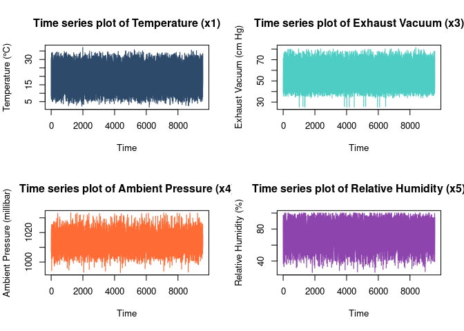<!-- -->

## Plotting time series for output variable

``` r
plot(Y_ts, main = "Time series plot of Electrical Energy Output", 
    xlab = "Time (hr)", ylab = "Electrical Energy Output (MW)", 
    col = colors$success, lwd = 1.2)
```

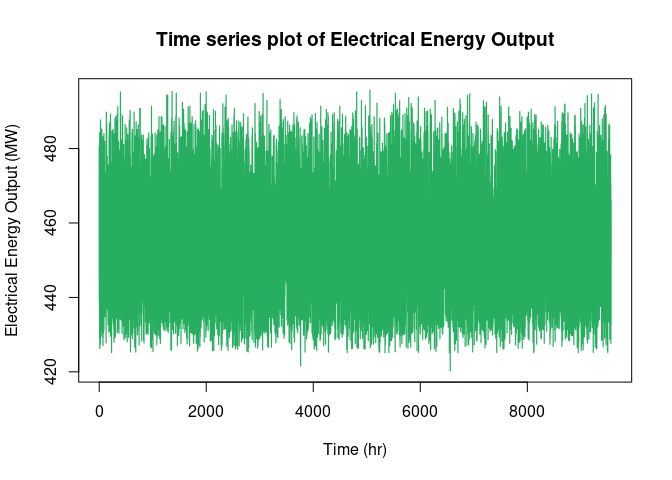<!-- -->

###############################################################################
# Task 1.2: Distribution plot for each variable
###############################################################################

## Density plot of all input variables (X)

``` r
density_X = density(X)
plot(density_X, main = "Density plot of all input variables (X)", 
     col = colors$purple, lwd = 2)
rug(jitter(X), col = colors$dark, lwd = 0.8)
```

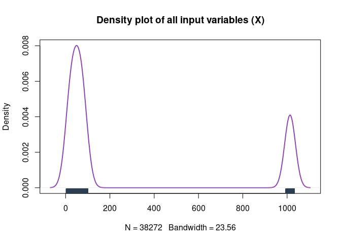<!-- -->

## Histogram plot of all input variables (X)

``` r
hist(X, freq = FALSE, main = "Histogram plot of all input variables (X)", 
     col = colors$light, border = colors$primary, lwd = 1.5)
rug(jitter(X), col = colors$dark, lwd = 0.8)
```

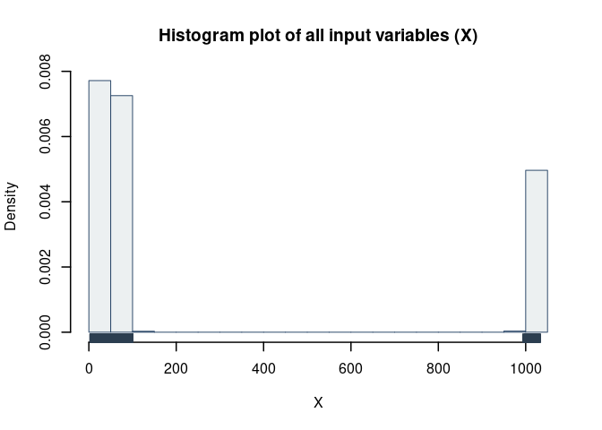<!-- -->

## Combine histogram and density plot of variable X

``` r
hist(X, freq = FALSE, main = "Histogram and density plot of all input variables (X)", 
     col = colors$light, border = colors$primary, lwd = 1.5)
lines(density_X, main = "Density plot of input variable X", 
      col = colors$purple, lwd = 2)
rug(jitter(X), col = colors$dark, lwd = 0.8)
```

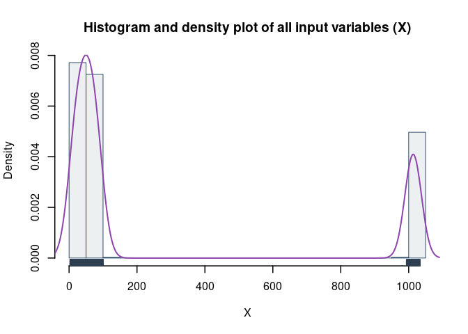<!-- -->

## Histograms with density plots for all input variables

``` r
par(mfrow=c(2,2))
```

## Histogram with density plot for Temperature

``` r
hist(X[,"Temperature"], freq = FALSE, main = "Distribution of Temperature",
     xlab = "Temperature (°C)", col = colors$light, border = colors$primary, lwd = 1.5)
lines(density(X[,"Temperature"]), lwd = 2, col = colors$secondary)
rug(jitter(X[,"Temperature"]), col = colors$dark, lwd = 0.8)
```

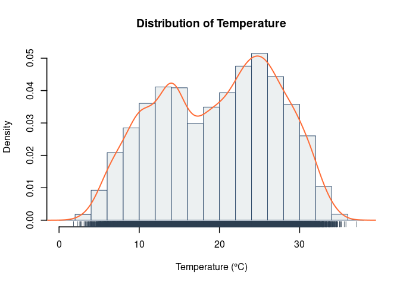<!-- -->

## Histogram with density plot for Exhaust Vacuum

``` r
hist(X[,"Vacuum"], freq = FALSE, main = "Distribution of Exhaust Vacuum",
     xlab = "Vacuum (cm Hg)", col = colors$light, border = colors$accent, lwd = 1.5)
lines(density(X[,"Vacuum"]), lwd = 2, col = colors$secondary)
rug(jitter(X[,"Vacuum"]), col = colors$dark, lwd = 0.8)
```

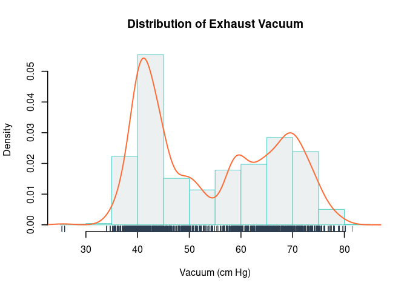<!-- -->

## Histogram with density plot for Ambient Pressure

``` r
hist(X[,"Pressure"], freq = FALSE, main = "Distribution of Ambient Pressure",
     xlab = "Pressure (millibar)", col = colors$light, border = colors$warning, lwd = 1.5)
lines(density(X[,"Pressure"]), lwd = 2, col = colors$secondary)
rug(jitter(X[,"Pressure"]), col = colors$dark, lwd = 0.8)
```

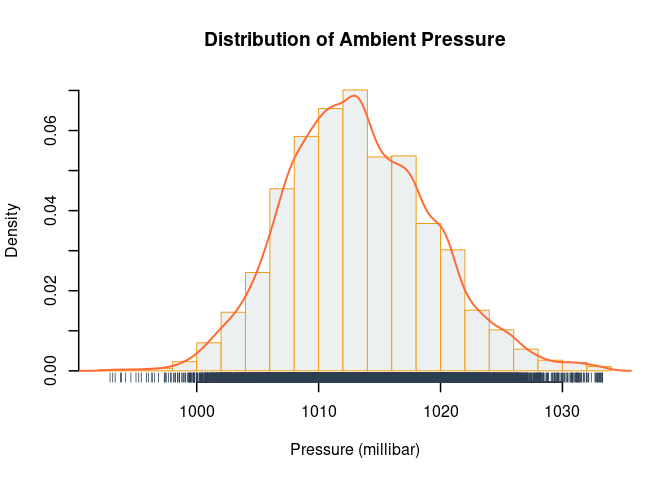<!-- -->

## Histogram with density plot for Relative Humidity

``` r
hist(X[,"Humidity"], freq = FALSE, main = "Distribution of Relative Humidity",
     xlab = "Humidity (%)", col = colors$light, border = colors$purple, lwd = 1.5)
lines(density(X[,"Humidity"]), lwd = 2, col = colors$secondary)
rug(jitter(X[,"Humidity"]), col = colors$dark, lwd = 0.8)
```

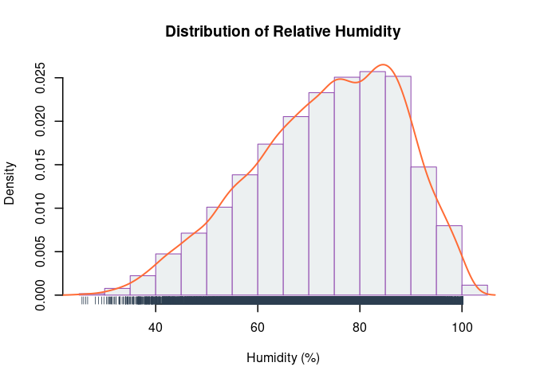<!-- -->

## Histogram with density plot for output variable

``` r
par(mfrow=c(1,1))
hist(Y, freq = FALSE, main = "Distribution of Electrical Energy Output",
     xlab = "Electrical Energy Output (MW)", 
     col = "#E8F5E8", border = colors$success, lwd = 1.5)
lines(density(Y), lwd = 2, col = colors$success)
rug(jitter(Y), col = colors$dark, lwd = 0.8)
```

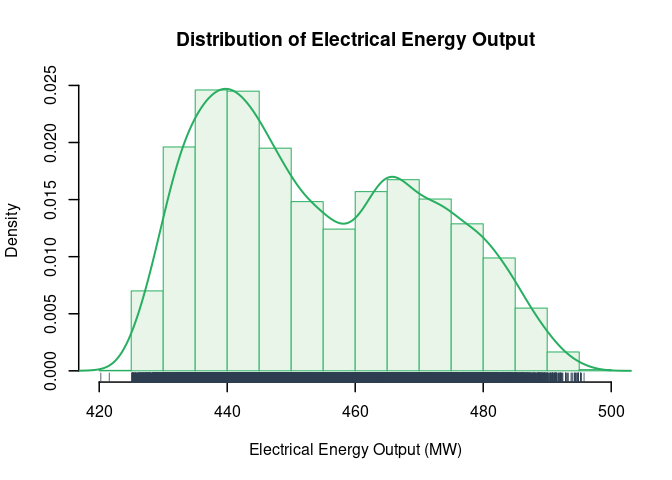<!-- -->

``` r
## Combined histogram plots for all four input variables in a 2x2 grid
par(mfrow=c(2,2))

# Histogram with density plot for Temperature
hist(X[,"Temperature"], freq = FALSE, main = "Distribution of Temperature",
     xlab = "Temperature (°C)", col = colors$light, border = colors$primary, lwd = 1.5)
lines(density(X[,"Temperature"]), lwd = 2, col = colors$secondary)
rug(jitter(X[,"Temperature"]), col = colors$dark, lwd = 0.8)

# Histogram with density plot for Exhaust Vacuum
hist(X[,"Vacuum"], freq = FALSE, main = "Distribution of Exhaust Vacuum",
     xlab = "Vacuum (cm Hg)", col = colors$light, border = colors$accent, lwd = 1.5)
lines(density(X[,"Vacuum"]), lwd = 2, col = colors$secondary)
rug(jitter(X[,"Vacuum"]), col = colors$dark, lwd = 0.8)

# Histogram with density plot for Ambient Pressure
hist(X[,"Pressure"], freq = FALSE, main = "Distribution of Ambient Pressure",
     xlab = "Pressure (millibar)", col = colors$light, border = colors$warning, lwd = 1.5)
lines(density(X[,"Pressure"]), lwd = 2, col = colors$secondary)
rug(jitter(X[,"Pressure"]), col = colors$dark, lwd = 0.8)

# Histogram with density plot for Relative Humidity
hist(X[,"Humidity"], freq = FALSE, main = "Distribution of Relative Humidity",
     xlab = "Humidity (%)", col = colors$light, border = colors$purple, lwd = 1.5)
lines(density(X[,"Humidity"]), lwd = 2, col = colors$secondary)
rug(jitter(X[,"Humidity"]), col = colors$dark, lwd = 0.8)
```

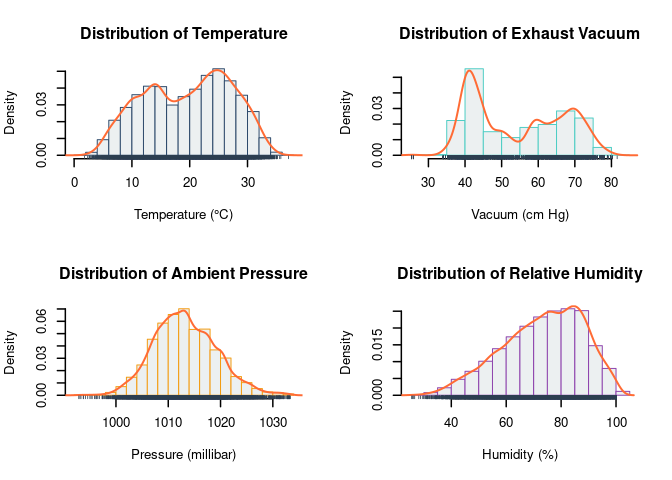<!-- -->

###############################################################################
# Task 1.3: Correlation and scatter plots
###############################################################################

## Plotting the scatter plots between input variables and output

``` r
par(mfrow=c(2,2))
plot(X[,"Temperature"], Y, main = "Temperature vs Electrical Energy Output",
     xlab = "Temperature (°C)", ylab = "Electrical Energy Output (MW)", 
     pch = 16, cex = 0.8, col = colors$primary)
abline(lm(Y ~ X[,"Temperature"]), col = colors$secondary, lwd = 2.5)

plot(X[,"Vacuum"], Y, main = "Vacuum vs Electrical Energy Output",
     xlab = "Vacuum (cm Hg)", ylab = "Electrical Energy Output (MW)", 
     pch = 16, cex = 0.8, col = colors$accent)
abline(lm(Y ~ X[,"Vacuum"]), col = colors$secondary, lwd = 2.5)

plot(X[,"Pressure"], Y, main = "Pressure vs Electrical Energy Output",
     xlab = "Pressure (millibar)", ylab = "Electrical Energy Output (MW)", 
     pch = 16, cex = 0.8, col = colors$warning)
abline(lm(Y ~ X[,"Pressure"]), col = colors$secondary, lwd = 2.5)

plot(X[,"Humidity"], Y, main = "Humidity vs Electrical Energy Output",
     xlab = "Humidity (%)", ylab = "Electrical Energy Output (MW)", 
     pch = 16, cex = 0.8, col = colors$purple)
abline(lm(Y ~ X[,"Humidity"]), col = colors$secondary, lwd = 2.5)
```

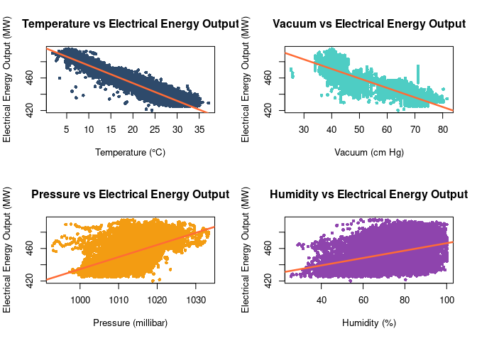<!-- -->

###############################################################################
# Task 2: Regression – modelling the relationship between electrical energy output
###############################################################################

## Creating a column of ones for the bias term

``` r
ones = matrix(1, nrow(X), 1)
head(ones)
```

```
##      [,1]
## [1,]    1
## [2,]    1
## [3,]    1
## [4,]    1
## [5,]    1
## [6,]    1
```

###############################################################################
# Task 2.1: Estimate model parameters for each candidate model
###############################################################################

## Model 1: y = θ₁x₄ + θ₂x₃² + θbias
## scaling the variables and binding data from equation of model 1

``` r
X_model1 <- cbind(scale(X[,"Pressure"]), scale(X[,"Vacuum"]^2), ones)
head(X_model1)
```

```
##            [,1]        [,2] [,3]
## [1,] -0.4073356 -1.02213385    1
## [2,] -0.3130402  0.21910945    1
## [3,] -1.0286750  0.08963496    1
## [4,] -1.0168880 -0.45270382    1
## [5,]  0.6518038 -1.02845500    1
## [6,]  0.4699484 -1.11294823    1
```

``` r
Model1_thetahat <- solve(t(X_model1) %*% X_model1) %*% t(X_model1) %*% Y
rownames(Model1_thetahat) <- c("θ₁", "θ₂", "θbias")
```

## Printing values for Model 1

``` r
print(Model1_thetahat)
```

```
##       Energy_Output
## θ₁         3.348278
## θ₂       -13.211452
## θbias    454.365009
```

``` r
t(Model1_thetahat)
```

```
##                     θ₁        θ₂   θbias
## Energy_Output 3.348278 -13.21145 454.365
```

## Model 2: y = θ₁x₄ + θ₂x₃² + θ₃x₅ + θbias
## scaling the variables and binding data from equation of model 2

``` r
X_model2 <- cbind(scale(X[,"Pressure"]), scale(X[,"Vacuum"]^2), scale(X[,"Humidity"]), ones)
Model2_thetahat <- solve(t(X_model2) %*% X_model2) %*% t(X_model2) %*% Y
rownames(Model2_thetahat) <- c("θ₁", "θ₂", "θ₃", "θbias")
```
## Printing values for Model 2

``` r
print(Model2_thetahat)
```

```
##       Energy_Output
## θ₁         3.432657
## θ₂       -12.406622
## θ₃         2.517326
## θbias    454.365009
```

``` r
t(Model2_thetahat)
```

```
##                     θ₁        θ₂       θ₃   θbias
## Energy_Output 3.432657 -12.40662 2.517326 454.365
```

## Model 3: y = θ₁x₃ + θ₂x₄ + θ₃x₅³
## scaling the variables and binding data from equation of model 3

``` r
X_model3 <- cbind(scale(X[,"Vacuum"]), scale(X[,"Pressure"]), scale(X[,"Humidity"]^3))
Model3_thetahat <- solve(t(X_model3) %*% X_model3) %*% t(X_model3) %*% Y
rownames(Model3_thetahat) <- c("θ₁", "θ₂", "θ₃")
```
## Printing values for Model 3

``` r
print(Model3_thetahat)
```

```
##    Energy_Output
## θ₁    -12.722943
## θ₂      3.402683
## θ₃      2.315840
```

``` r
t(Model3_thetahat)
```

```
##                      θ₁       θ₂      θ₃
## Energy_Output -12.72294 3.402683 2.31584
```

## Model 4: y = θ₁x₄ + θ₂x₃² + θ₃x₅³ + θbias
## scaling the variables and binding data from equation of model 4

``` r
X_model4 <- cbind(scale(X[,"Pressure"]), scale(X[,"Vacuum"]^2), scale(X[,"Humidity"]^3), ones)
```
## Calculating theta hat for Model 4

``` r
Model4_thetahat <- solve(t(X_model4) %*% X_model4) %*% t(X_model4) %*% Y
rownames(Model4_thetahat) <- c("θ₁", "θ₂", "θ₃", "θbias")
```
## Printing values for Model 4

``` r
print(Model4_thetahat)
```

```
##       Energy_Output
## θ₁         3.487220
## θ₂       -12.402038
## θ₃         2.487015
## θbias    454.365009
```

``` r
t(Model4_thetahat)
```

```
##                    θ₁        θ₂       θ₃   θbias
## Energy_Output 3.48722 -12.40204 2.487015 454.365
```
## Model 5: y = θ₁x₄ + θ₂x₁² + θ₃x₃² + θbias
## scaling the variables and binding data from equation of model 5

``` r
X_model5 <- cbind(scale(X[,"Pressure"]), scale(X[,"Temperature"]^2), scale(X[,"Vacuum"]^2), ones)
Model5_thetahat <- solve(t(X_model5) %*% X_model5) %*% t(X_model5) %*% Y
rownames(Model5_thetahat) <- c("θ₁", "θ₂", "θ₃", "θbias")
```
## Printing values for Model 5

``` r
print(Model5_thetahat)
```

```
##       Energy_Output
## θ₁         1.349107
## θ₂       -10.605331
## θ₃        -5.173124
## θbias    454.365009
```

``` r
t(Model5_thetahat)
```

```
##                     θ₁        θ₂        θ₃   θbias
## Energy_Output 1.349107 -10.60533 -5.173124 454.365
```

###############################################################################
# Task 2.2: Calculating the RSS value for each candidate model
###############################################################################

## Calculating predicted values and RSS for Model 1

``` r
Y_hat_model1 <- X_model1 %*% Model1_thetahat
RSS_Model_1 <- sum((Y - Y_hat_model1)^2)
```

## Calculating predicted values and RSS for Model 2

``` r
Y_hat_model2 <- X_model2 %*% Model2_thetahat
RSS_Model_2 <- sum((Y - Y_hat_model2)^2)
```

## Calculating predicted values and RSS for Model 3

``` r
Y_hat_model3 <- X_model3 %*% Model3_thetahat
RSS_Model_3 <- sum((Y - Y_hat_model3)^2)
```

## Calculating predicted values and RSS for Model 4

``` r
Y_hat_model4 <- X_model4 %*% Model4_thetahat
RSS_Model_4 <- sum((Y - Y_hat_model4)^2)
```

## Calculating predicted values and RSS for Model 5

``` r
Y_hat_model5 <- X_model5 %*% Model5_thetahat
RSS_Model_5 <- sum((Y - Y_hat_model5)^2)
```

## Creating a data frame of RSS values for comparison

``` r
RSS_values <- data.frame(
  Model = c("Model 1", "Model 2", "Model 3", "Model 4", "Model 5"),
  RSS = c(RSS_Model_1, RSS_Model_2, RSS_Model_3, RSS_Model_4, RSS_Model_5)
)
```
## Printing Residual Sum of Squares (RSS) for All Models

``` r
print(RSS_values)
```

```
##     Model          RSS
## 1 Model 1     657248.2
## 2 Model 2     602347.1
## 3 Model 3 1975837762.7
## 4 Model 4     603630.7
## 5 Model 5     365625.0
```

###############################################################################
# Task 2.3: Calculating log-likelihood and variance
###############################################################################

## Total number of observations

``` r
N <- nrow(Y)
```

## Calculating variance and log-likelihood for Model 1

``` r
Variance_model1 <- RSS_Model_1 / (N - 1)
likelihood_Model_1 <- -(N/2) * log(2*pi) - (N/2) * log(Variance_model1) - 
                      (1/(2*Variance_model1)) * RSS_Model_1
```

## Calculating variance and log-likelihood for Model 2

``` r
Variance_model2 <- RSS_Model_2 / (N - 1)
likelihood_Model_2 <- -(N/2) * log(2*pi) - (N/2) * log(Variance_model2) - 
                      (1/(2*Variance_model2)) * RSS_Model_2
```

## Calculating variance and log-likelihood for Model 3

``` r
Variance_model3 <- RSS_Model_3 / (N - 1)
likelihood_Model_3 <- -(N/2) * log(2*pi) - (N/2) * log(Variance_model3) - 
                      (1/(2*Variance_model3)) * RSS_Model_3
```

## Calculating variance and log-likelihood for Model 4

``` r
Variance_model4 <- RSS_Model_4 / (N - 1)
likelihood_Model_4 <- -(N/2) * log(2*pi) - (N/2) * log(Variance_model4) - 
                      (1/(2*Variance_model4)) * RSS_Model_4
```

## Calculating variance and log-likelihood for Model 5

``` r
Variance_model5 <- RSS_Model_5 / (N - 1)
likelihood_Model_5 <- -(N/2) * log(2*pi) - (N/2) * log(Variance_model5) - 
                      (1/(2*Variance_model5)) * RSS_Model_5
```

## Creating data frames for variance and likelihood values

``` r
variance_values <- data.frame(
  Model = c("Model 1", "Model 2", "Model 3", "Model 4", "Model 5"),
  Variance = c(Variance_model1, Variance_model2, Variance_model3, 
               Variance_model4, Variance_model5)
)

likelihood_values <- data.frame(
  Model = c("Model 1", "Model 2", "Model 3", "Model 4", "Model 5"),
  LogLikelihood = c(likelihood_Model_1, likelihood_Model_2, likelihood_Model_3, 
                    likelihood_Model_4, likelihood_Model_5)
)
```

## Printing Variance Values for All Models

``` r
print(variance_values)
```

```
##     Model     Variance
## 1 Model 1     68.69951
## 2 Model 2     62.96091
## 3 Model 3 206526.36800
## 4 Model 4     63.09509
## 5 Model 5     38.21731
```

## Printing Log-Likelihood Values for All Models

``` r
print(likelihood_values)
```

```
##     Model LogLikelihood
## 1 Model 1     -33810.99
## 2 Model 2     -33393.69
## 3 Model 3     -72123.37
## 4 Model 4     -33403.88
## 5 Model 5     -31005.40
```

###############################################################################
# Task 2.4: Compute AIC and BIC for every candidate model
###############################################################################

## Calculating the number of parameters (K) for each model

``` r
K_model1 <- length(Model1_thetahat)
K_model2 <- length(Model2_thetahat)
K_model3 <- length(Model3_thetahat)
K_model4 <- length(Model4_thetahat)
K_model5 <- length(Model5_thetahat)
```

## Calculating AIC for each model

``` r
AIC_model1 <- 2 * K_model1 - 2 * likelihood_Model_1
AIC_model2 <- 2 * K_model2 - 2 * likelihood_Model_2
AIC_model3 <- 2 * K_model3 - 2 * likelihood_Model_3
AIC_model4 <- 2 * K_model4 - 2 * likelihood_Model_4
AIC_model5 <- 2 * K_model5 - 2 * likelihood_Model_5
```

## Calculating BIC for each model

``` r
BIC_model1 <- K_model1 * log(N) - 2 * likelihood_Model_1
BIC_model2 <- K_model2 * log(N) - 2 * likelihood_Model_2
BIC_model3 <- K_model3 * log(N) - 2 * likelihood_Model_3
BIC_model4 <- K_model4 * log(N) - 2 * likelihood_Model_4
BIC_model5 <- K_model5 * log(N) - 2 * likelihood_Model_5
```

## Creating data frames for K, AIC, and BIC values

``` r
parameter_counts <- data.frame(
  Model = c("Model 1", "Model 2", "Model 3", "Model 4", "Model 5"),
  K = c(K_model1, K_model2, K_model3, K_model4, K_model5)
)

AIC_values <- data.frame(
  Model = c("Model 1", "Model 2", "Model 3", "Model 4", "Model 5"),
  AIC = c(AIC_model1, AIC_model2, AIC_model3, AIC_model4, AIC_model5)
)

BIC_values <- data.frame(
  Model = c("Model 1", "Model 2", "Model 3", "Model 4", "Model 5"),
  BIC = c(BIC_model1, BIC_model2, BIC_model3, BIC_model4, BIC_model5)
)
```

## Printing Number of Parameters (K) for Each Model

``` r
print(parameter_counts)
```

```
##     Model K
## 1 Model 1 3
## 2 Model 2 4
## 3 Model 3 3
## 4 Model 4 4
## 5 Model 5 4
```

## Printing AIC Values for All Models

``` r
print(AIC_values)
```

```
##     Model       AIC
## 1 Model 1  67627.98
## 2 Model 2  66795.38
## 3 Model 3 144252.75
## 4 Model 4  66815.75
## 5 Model 5  62018.79
```

## Printing BIC Values for All Models

``` r
print(BIC_values)
```

```
##     Model       BIC
## 1 Model 1  67649.48
## 2 Model 2  66824.05
## 3 Model 3 144274.24
## 4 Model 4  66844.42
## 5 Model 5  62047.46
```

###############################################################################
# Task 2.5: Checking the distribution of model prediction errors (residuals)
###############################################################################


``` r
par(mfrow=c(2,3))
```

## Calculating and plotting residuals for Model 1

``` r
model1_error <- Y - Y_hat_model1
qqnorm(model1_error, main = "Q-Q Plot for Model 1", col = colors$primary, pch = 16)
qqline(model1_error, col = colors$secondary, lwd = 2)
```

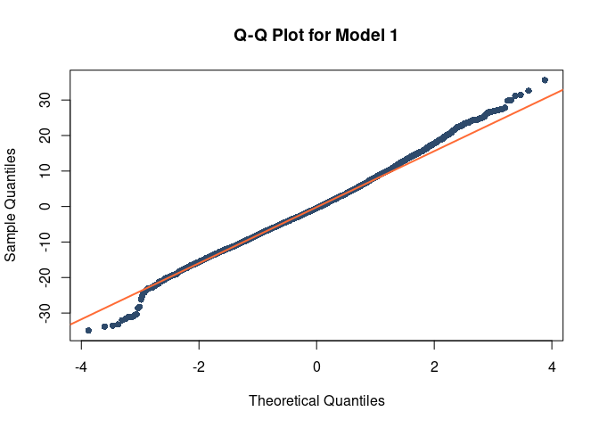<!-- -->

## Calculating and plotting residuals for Model 2

``` r
model2_error <- Y - Y_hat_model2
qqnorm(model2_error, main = "Q-Q Plot for Model 2", col = colors$accent, pch = 16)
qqline(model2_error, col = colors$secondary, lwd = 2)
```

<!-- -->

## Calculating and plotting residuals for Model 3

``` r
model3_error <- Y - Y_hat_model3
qqnorm(model3_error, main = "Q-Q Plot for Model 3", col = colors$warning, pch = 16)
qqline(model3_error, col = colors$secondary, lwd = 2)
```

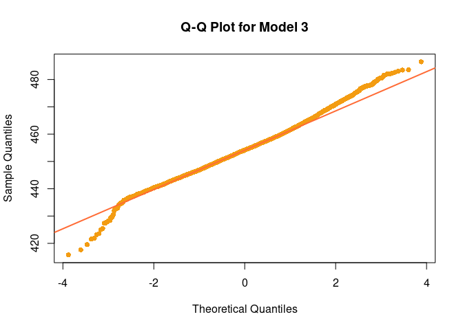<!-- -->

## Calculating and plotting residuals for Model 4

``` r
model4_error <- Y - Y_hat_model4
qqnorm(model4_error, main = "Q-Q Plot for Model 4", col = colors$purple, pch = 16)
qqline(model4_error, col = colors$secondary, lwd = 2)
```

<!-- -->

## Calculating and plotting residuals for Model 5

``` r
model5_error <- Y - Y_hat_model5
qqnorm(model5_error, main = "Q-Q Plot for Model 5", col = colors$success, pch = 16)
qqline(model5_error, col = colors$secondary, lwd = 2)
```

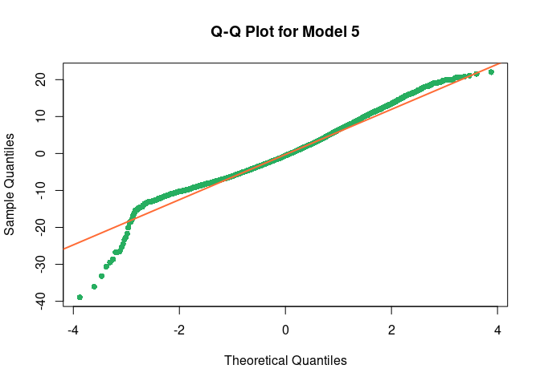<!-- -->

###############################################################################
# Task 2.6: Selecting the best regression model
###############################################################################

## Resetting plot layout

``` r
par(mfrow=c(1,1))
```

## Combining all evaluation metrics for comparison

``` r
model_comparison <- data.frame(
  Model = c("Model 1", "Model 2", "Model 3", "Model 4", "Model 5"),
  RSS = c(RSS_Model_1, RSS_Model_2, RSS_Model_3, RSS_Model_4, RSS_Model_5),
  AIC = c(AIC_model1, AIC_model2, AIC_model3, AIC_model4, AIC_model5),
  BIC = c(BIC_model1, BIC_model2, BIC_model3, BIC_model4, BIC_model5)
)
```

## Finding the best model based on each criterion

``` r
best_RSS_model <- model_comparison$Model[which.min(model_comparison$RSS)]
best_AIC_model <- model_comparison$Model[which.min(model_comparison$AIC)]
best_BIC_model <- model_comparison$Model[which.min(model_comparison$BIC)]
```

## Printing the comparison values

``` r
print(model_comparison)
```

```
##     Model          RSS       AIC       BIC
## 1 Model 1     657248.2  67627.98  67649.48
## 2 Model 2     602347.1  66795.38  66824.05
## 3 Model 3 1975837762.7 144252.75 144274.24
## 4 Model 4     603630.7  66815.75  66844.42
## 5 Model 5     365625.0  62018.79  62047.46
```

###############################################################################
# Task 2.7: Training/Testing Split and Confidence Intervals
###############################################################################

## Splitting data together to maintain correspondence

``` r
set.seed(123)
combined_data <- data.frame(X, Y)
split_indices <- initial_split(combined_data, prop = 0.7)
training_set <- training(split_indices)
testing_set <- testing(split_indices)
```

## Extracting training and testing data

``` r
X_train <- as.matrix(training_set[, c("Temperature", "Vacuum", "Pressure", "Humidity")])
Y_train <- as.matrix(training_set[, "Energy_Output"])
X_test <- as.matrix(testing_set[, c("Temperature", "Vacuum", "Pressure", "Humidity")])
Y_test <- as.matrix(testing_set[, "Energy_Output"])
```

## Model 5: y = θ₁x₄ + θ₂x₁² + θ₃x₃² + θbias (Pressure + Temperature² + Vacuum²)

``` r
ones_train <- matrix(1, nrow(X_train), 1)
X_train_model <- cbind(scale(X_train[, "Pressure"]), 
                       scale(X_train[, "Temperature"]^2), 
                       scale(X_train[, "Vacuum"]^2), 
                       ones_train)
```

## Estimating parameters

``` r
train_thetahat <- solve(t(X_train_model) %*% X_train_model) %*% t(X_train_model) %*% Y_train
```

## Preparing test data

``` r
ones_test <- matrix(1, nrow(X_test), 1)
X_test_model <- cbind(scale(X_test[, "Pressure"]), 
                      scale(X_test[, "Temperature"]^2), 
                      scale(X_test[, "Vacuum"]^2), 
                      ones_test)
```

## Making predictions

``` r
Y_test_pred <- X_test_model %*% train_thetahat
```

## Proper confidence intervals

``` r
residuals <- Y_test - Y_test_pred
std_error <- sqrt(sum(residuals^2) / (nrow(Y_test) - ncol(X_test_model)))
t_value <- qt(0.975, df = nrow(Y_test) - ncol(X_test_model))
lower_CI <- Y_test_pred - t_value * std_error
upper_CI <- Y_test_pred + t_value * std_error
```

## Plotting with error bars

``` r
plot(1:length(Y_test), Y_test, pch = 16, col = colors$primary, 
     ylim = c(min(lower_CI), max(upper_CI)), cex = 1.2,
     xlab = "Sample Index", ylab = "Power Output (MW)",
     main = "Model Predictions with 95% Confidence Intervals")
points(1:length(Y_test), Y_test_pred, pch = 17, col = colors$secondary, cex = 1.2)
arrows(1:length(Y_test), lower_CI, 1:length(Y_test), upper_CI, 
       length = 0.03, angle = 90, code = 3, col = colors$success, lwd = 1.5)
legend("topright", 
       legend = c("Actual", "Predicted", "95% CI"),
       col = c(colors$primary, colors$secondary, colors$success), 
       pch = c(16, 17, NA), lty = c(NA, NA, 1), lwd = c(NA, NA, 1.5))
```

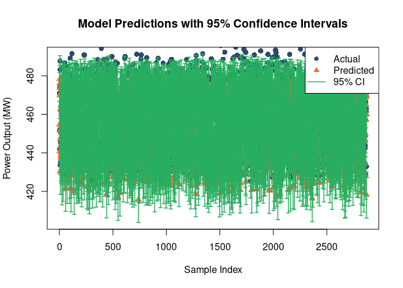<!-- -->

``` r
# Performance metrics
print(paste("RSS:", sum(residuals^2)))
```

```
## [1] "RSS: 106715.324826487"
```

``` r
print(paste("MAE:", mean(abs(residuals))))
```

```
## [1] "MAE: 4.858553634188"
```

``` r
print(paste("RMSE:", sqrt(mean(residuals^2))))
```

```
## [1] "RMSE: 6.09672770909037"
```

###############################################################################
# Task 3: Approximate Bayesian Computation (ABC) 
###############################################################################

## From Task 2.6, we determined Model 5 is the best performing model
## Model 5: y = θ₁x₄ + θ₂x₁² + θ₃x₃² + θbias
## Identifying the parameters with largest absolute values

``` r
print("Model 5 Parameter Estimates:")
```

```
## [1] "Model 5 Parameter Estimates:"
```

``` r
print(Model5_thetahat)
```

```
##       Energy_Output
## θ₁         1.349107
## θ₂       -10.605331
## θ₃        -5.173124
## θbias    454.365009
```

## Calculating absolute values of all parameters

``` r
param_abs_values <- abs(Model5_thetahat)
print("Absolute values of parameters:")
```

```
## [1] "Absolute values of parameters:"
```

``` r
print(param_abs_values)
```

```
##       Energy_Output
## θ₁         1.349107
## θ₂        10.605331
## θ₃         5.173124
## θbias    454.365009
```

## Finding the two largest absolute values

``` r
sorted_indices <- order(param_abs_values, decreasing = TRUE)
top_two_indices <- sorted_indices[1:2]
top_two_params <- Model5_thetahat[top_two_indices]
param_names <- rownames(Model5_thetahat)[top_two_indices]

print("Two parameters with largest absolute values:")
```

```
## [1] "Two parameters with largest absolute values:"
```

``` r
for(i in 1:2) {
  print(paste(param_names[i], "=", top_two_params[i]))
}
```

```
## [1] "θbias = 454.365009406354"
## [1] "θ₂ = -10.6053309550988"
```

## Setting up uniform priors around the estimated parameter values
## We'll use a range of ±100% of the absolute value of each parameter

``` r
prior_ranges <- matrix(0, 2, 2)
scaling_factor <- 1  # 100% of the parameter value

for(i in 1:2) {
  param_value <- top_two_params[i]
  range_width <- scaling_factor * abs(param_value)
  prior_ranges[i, 1] <- param_value - range_width  # Lower bound
  prior_ranges[i, 2] <- param_value + range_width  # Upper bound
}

rownames(prior_ranges) <- param_names
colnames(prior_ranges) <- c("Lower_Bound", "Upper_Bound")

print("Prior Distribution Ranges:")
```

```
## [1] "Prior Distribution Ranges:"
```

``` r
print(prior_ranges)
```

```
##       Lower_Bound Upper_Bound
## θbias     0.00000      908.73
## θ₂      -21.21066        0.00
```

## Function to generate samples from uniform prior distributions

``` r
generate_prior_sample <- function() {
  c(
    runif(1, prior_ranges[1, 1], prior_ranges[1, 2]),
    runif(1, prior_ranges[2, 1], prior_ranges[2, 2])
  )
}
```

## Creating fixed parameters (the ones we're not varying)

``` r
fixed_params <- Model5_thetahat
fixed_indices <- setdiff(1:length(Model5_thetahat), top_two_indices)

print("Fixed parameters:")
```

```
## [1] "Fixed parameters:"
```

``` r
print(fixed_params[fixed_indices])
```

```
## [1]  1.349107 -5.173124
```

## Calculating RSS for a given set of parameters

``` r
calculate_RSS <- function(params) {
  # Creating a complete parameter set
  full_params <- fixed_params
  full_params[top_two_indices] <- params
  
  # Calculate predictions using Model 5 structure
  X_model5_abc <- cbind(scale(X[,"Pressure"]), 
                        scale(X[,"Temperature"]^2), 
                        scale(X[,"Vacuum"]^2), 
                        ones)
  Y_pred <- X_model5_abc %*% full_params
  
  # Calculate RSS
  sum((Y - Y_pred)^2)
}
```

## Getting the RSS of our best model as reference

``` r
best_model_RSS <- RSS_Model_5
print(paste("Best model RSS:", best_model_RSS))
```

```
## [1] "Best model RSS: 365624.974504425"
```

## Setting up rejection ABC parameters

``` r
num_samples <- 10000  # Number of samples to generate
accepted_samples <- matrix(0, 0, 2)  # Matrix to store accepted samples
colnames(accepted_samples) <- param_names
```

## Setting threshold as 5 times the best model RSS (500% tolerance)

``` r
threshold <- best_model_RSS * 5.0
print(paste("ABC threshold:", threshold))
```

```
## [1] "ABC threshold: 1828124.87252213"
```

## Performing rejection ABC with progress monitoring

``` r
cat("Performing rejection ABC sampling...\n")
```

```
## Performing rejection ABC sampling...
```

``` r
for(i in 1:num_samples) {
  # Generating sample from prior
  sample_params <- generate_prior_sample()
  
  # Calculating RSS for this parameter combination
  sample_RSS <- calculate_RSS(sample_params)
  
  # Accept or reject based on threshold
  if(sample_RSS <= threshold) {
    accepted_samples <- rbind(accepted_samples, sample_params)
  }
  
  # Progress indicator every 2000 samples
  if(i %% 2000 == 0) {
    current_rate <- round(nrow(accepted_samples)/i * 100, 2)
    cat("Processed", i, "samples, accepted", nrow(accepted_samples), 
        "- Rate:", current_rate, "%\n")
  }
}
```

```
## Processed 2000 samples, accepted 44 - Rate: 2.2 %
## Processed 4000 samples, accepted 88 - Rate: 2.2 %
## Processed 6000 samples, accepted 140 - Rate: 2.33 %
## Processed 8000 samples, accepted 181 - Rate: 2.26 %
## Processed 10000 samples, accepted 228 - Rate: 2.28 %
```

``` r
print(paste("Total accepted samples:", nrow(accepted_samples)))
```

```
## [1] "Total accepted samples: 228"
```

``` r
print(paste("Acceptance rate:", round(nrow(accepted_samples)/num_samples * 100, 2), "%"))
```

```
## [1] "Acceptance rate: 2.28 %"
```

## Plotting joint and marginal posterior distributions with error handling

``` r
if(nrow(accepted_samples) >= 10) {
  
  # Clear any existing plot device issues
  tryCatch({
    # Set up plotting area
    par(mfrow=c(2,2))
    
    # Joint posterior distribution
    plot(accepted_samples[, 1], accepted_samples[, 2], 
         pch = 16, cex = 0.8, col = colors$primary, 
         xlab = param_names[1], ylab = param_names[2],
         main = "Joint Posterior Distribution")
    
    # Adding lines showing the point estimates
    abline(v = top_two_params[1], col = colors$secondary, lty = 2, lwd = 2)
    abline(h = top_two_params[2], col = colors$secondary, lty = 2, lwd = 2)
    
    # Adding point estimate
    points(top_two_params[1], top_two_params[2], 
           col = colors$danger, pch = 16, cex = 1.8)
    
    legend("topright", 
           legend = c("Posterior samples", "Point estimate"), 
           col = c(colors$primary, colors$danger), 
           pch = c(16, 16))
    
    # Plotting marginal posterior distribution for first parameter
    hist(accepted_samples[, 1], breaks = 30, 
         col = colors$light, border = colors$primary, lwd = 1.5,
         main = paste("Marginal Posterior of", param_names[1]),
         xlab = param_names[1], ylab = "Frequency")
    abline(v = top_two_params[1], col = colors$secondary, lty = 2, lwd = 2)
    abline(v = mean(accepted_samples[, 1]), col = colors$success, lty = 2, lwd = 2)
    
    legend("topright", 
           legend = c("Point estimate", "Posterior mean"), 
           col = c(colors$secondary, colors$success), 
           lty = c(2, 2), lwd = c(2, 2))
    
    # Marginal posterior distribution for second parameter
    hist(accepted_samples[, 2], breaks = 30, 
         col = colors$light, border = colors$primary, lwd = 1.5,
         main = paste("Marginal Posterior of", param_names[2]),
         xlab = param_names[2], ylab = "Frequency")
    abline(v = top_two_params[2], col = colors$secondary, lty = 2, lwd = 2)
    abline(v = mean(accepted_samples[, 2]), col = colors$success, lty = 2, lwd = 2)
    
    legend("topright", 
           legend = c("Point estimate", "Posterior mean"), 
           col = c(colors$secondary, colors$success), 
           lty = c(2, 2), lwd = c(2, 2))
    
  }, error = function(e) {
    cat("Plotting error occurred:", e$message, "\n")
    cat("Continuing with summary statistics...\n")
  })
  
  # Reset plot layout
  par(mfrow=c(1,1))
  
  # Calculating summary statistics for posterior distributions
  posterior_means <- colMeans(accepted_samples)
  posterior_sds <- apply(accepted_samples, 2, sd)
  posterior_medians <- apply(accepted_samples, 2, median)
  
  # Calculating credible intervals (Bayesian equivalent of confidence intervals)
  credible_intervals <- apply(accepted_samples, 2, function(x) {
    quantile(x, c(0.025, 0.975))
  })
  
  # Creating summary table
  summary_stats <- data.frame(
    Parameter = param_names,
    Point_Estimate = top_two_params,
    Posterior_Mean = posterior_means,
    Posterior_Median = posterior_medians,
    Posterior_SD = posterior_sds,
    CI_Lower = credible_intervals[1, ],
    CI_Upper = credible_intervals[2, ]
  )
  
  # Printing posterior distribution summary
  print(summary_stats)
} else {
  cat("Error: Too few accepted samples for meaningful analysis.\n")
  cat("Suggestions:\n")
  cat("1. Increase the threshold (try threshold <- best_model_RSS * 10.0)\n")
  cat("2. Increase the number of samples (try num_samples <- 50000)\n")
  cat("3. Widen the prior ranges (try scaling_factor <- 2.0)\n")
}
```

<!-- -->

```
##       Parameter Point_Estimate Posterior_Mean Posterior_Median Posterior_SD
## θbias     θbias      454.36501      453.77996        453.15467     6.156728
## θ₂           θ₂      -10.60533      -11.17737        -11.42895     5.628170
##       CI_Lower   CI_Upper
## θbias 443.9368 465.521105
## θ₂    -20.4100  -1.432695
```
